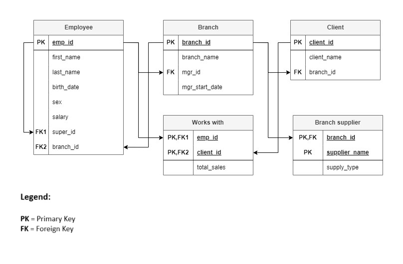

# A Company Database Sample

## Overview

This repository contains a sample company database designed and implemented using MySQL. The database is created to demonstrate fundamental principles of database design, normalization, and SQL query implementation. It represents a fictional company with entities such as employees, branches, clients, and suppliers.

## Getting Started

To set up the database, follow these steps:

1. [Clone the repository](https://github.com/NiteshNP17/company_db.git) to your local machine.
2. Use the provided SQL script to create the database schema in your preferred SQL database.
3. Explore the ER Diagram and the Conceptual Data Model to understand the relationships between different entities.

## ER Diagram

## Conceptual Data Model

